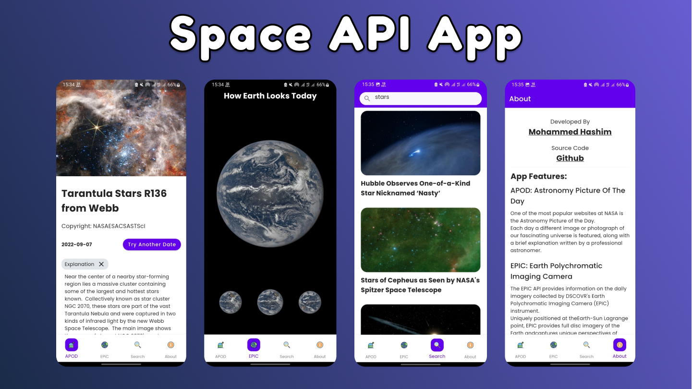

Space API App - Flutter App Uses Nasa Public APIs 
-------------  
Flutter App uses Nasa APIs to search nasa library and view up-to-date images of earth

### To try the app download the apk from the [Release Tab](https://github.com/mohammedhashim44/flutter_nasa_app/releases/tag/1.0.2)  

---
### Note: if the app didn't work, its probably because the API KEY has reached its limits.
### To test with your own key, visit [Nasa Website](https://api.nasa.gov/) and create new API KEY and replace it with the old key in `lib/src/repositories/api_repository.dart`.
---

# Screenshots

	

	

   
  
  
  
  
  
  
  

-------------
## Flutter Version Used : 2.5.3
### Features:
- Developed using MVC pattern
- Lottie Animation
- APOD (Astronomy Picture Of The Day)
	- Picture title and description
	- Youtube/Network video player for video items
	- Can choose diffrent dates
	- Open, zoom and download picture
- EPIC Images: how earth looks today
- Search and query in Nasa Media Library
-------------  
### APIS Used:
- [https://api.nasa.gov/](https://api.nasa.gov/)
- [https://images.nasa.gov/docs/images.nasa.gov_api_docs.pdf](https://images.nasa.gov/docs/images.nasa.gov_api_docs.pdf)
- [Nasa API Documentation](https://www.postman.com/miguelolave/workspace/nasa-open-apis/collection/3419756-ec8393eb-f0c1-4457-a152-242b5fb4d072?ctx=documentation)
### Assets Credit
- [Launcher Icon](https://www.freepik.com/free-vector/cute-astronaut-with-earth-space-cartoon-vector-icon-illustration-technology-science-icon-concept-isolated-premium-vector-flat-cartoon-style_19613621.htm#query=nasa%20icon&position=0&from_view=search)
- [Loading Animation](https://lottiefiles.com/78396-space)
